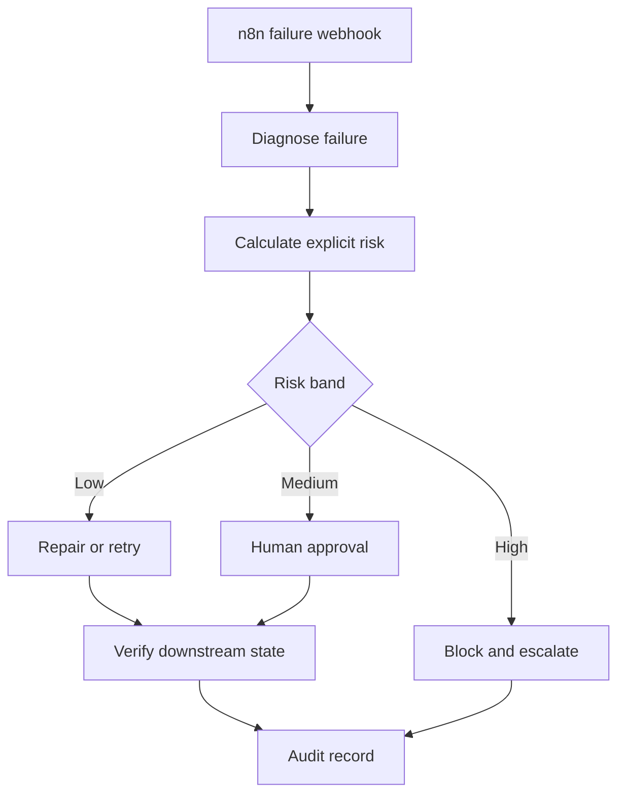

# SafeRecover

**Risk-aware autonomous recovery for failed n8n workflows.** SafeRecover simulates three real SME operations—invoice processing, legal document intake, and expense approval. It consumes failed executions, uses Gemini structured outputs to diagnose them, computes risk from explicit operational signals, and permits only low-risk reversible actions to run automatically. Medium-risk actions require approval; high-risk actions are blocked and escalated. Every attempted recovery is followed by a downstream-state verification callback and stored in an auditable decision record.

   

## Why this exists

When a business automation fails, an operator typically inspects the execution log, identifies the cause, decides whether retrying or changing input is safe, restarts the workflow, and checks the downstream state. Existing AI error handlers often stop at suggesting a fix. SafeRecover implements a closed recovery loop with a hard safety boundary:



## Safety policy

Risk is deterministic and inspectable rather than an LLM self-reported confidence score:

`risk = .28 financial impact + .22 irreversibility + .18 ambiguity + .14 evidence disagreement + .10 low confidence + .08 failure history`

- **Low (< 0.30):** bounded retry, allowlisted payload repair, or duplicate suppression.
- **Medium (0.30–0.59):** operator approval before execution.
- **High (>= 0.60):** block and escalate.
- Authentication failures, missing critical fields, material data conflicts, and repeated failures are always blocked regardless of the numeric score.

## Repository structure

```text
backend/       FastAPI API, SQLAlchemy persistence, policy and tests
frontend/      React + TypeScript operations dashboard
n8n/           Three SME simulations plus failure-capture and recovery workflows
evaluation/    Labelled 60-case failure-injection benchmark
.github/       CI for tests, evaluation and production frontend build
render.yaml    Cloud infrastructure blueprint
```

## Run locally

### Quick developer mode (SQLite)

```bash
python -m venv .venv
source .venv/bin/activate       # Windows: .venv\Scripts\activate
pip install -r backend/requirements-dev.txt
cd backend && uvicorn app.main:app --reload
```

In a second terminal:

```bash
cd frontend
npm install
npm run dev
```

Open `http://localhost:5173`. The dashboard falls back to realistic demo data if the API is unavailable, and switches to live mode when connected.

### Production-like stack

```bash
docker compose up --build
```

This starts PostgreSQL, the API on `http://localhost:8000`, n8n on `http://localhost:5678`, and the dashboard on `http://localhost:8080`.

## Diagnosis model

Set `GEMINI_API_KEY` to enable `gemini-2.5-flash-lite` structured diagnosis. The model returns a schema-validated failure class, explanation, proposed action, and allowlisted repair type. If the key is missing or the API fails, SafeRecover falls back to deterministic diagnosis rules, so the recovery service remains available.

The model's proposal is never executed directly. Hard safety rules and the explicit risk score remain authoritative and can downgrade any model proposal to approval or escalation.

## Connect n8n

1. Import all five JSON files from `n8n/`.
2. Set `SAFERECOVER_API_URL` in n8n to the backend URL.
3. Configure `N8N_RETRY_WEBHOOK_URL` for the API.
4. Select **SafeRecover - Failure Capture** as the error workflow for an n8n workflow.
5. Set the SafeRecover failure-capture workflow as the error workflow for each SME simulation, then activate them.

The included n8n runner deliberately limits repair to allowlisted defaults and schema normalisation. It is an integration example, not permission for arbitrary generated code execution.

## API example

```bash
curl -X POST http://localhost:8000/api/v1/failures \
  -H "Content-Type: application/json" \
  -d '{"workflow_name":"Invoice Intake","execution_id":"exec-42","node_name":"Parse invoice","error_type":"MALFORMED_JSON","error_message":"Unexpected token","reversible":true,"confidence":0.95}'
```

Interactive API documentation is available at `http://localhost:8000/docs`.

## Deploy to the cloud

The repository is cloud-first: `render.yaml` defines the FastAPI service, n8n, PostgreSQL, and the static React dashboard. Follow [`docs/CLOUD_DEPLOYMENT.md`](docs/CLOUD_DEPLOYMENT.md) to create the Blueprint, set secrets, import the workflows, and verify an end-to-end failure from a public webhook.

## Evaluation

```bash
python evaluation/run_evaluation.py
```

The benchmark expands 12 labelled failure archetypes into 60 deterministic cases and reports:

- recovery-action accuracy;
- unsafe autonomous recovery rate;
- recoverable-case automation rate; and
- decision distribution.

Run backend tests with `cd backend && pytest -q`. The suite covers low-risk retries, hard safety rules, circuit breaking, approval, downstream verification, and the unsafe-autonomy metric.

## Interview-ready summary

**Manual work:** Operators inspected failed workflow logs, diagnosed the cause, judged whether intervention was safe, manually retried or repaired an execution, and checked the downstream result.

**What I built:** A FastAPI recovery control plane for n8n that combines typed failure diagnosis, an explicit risk model, gated recovery actions, PostgreSQL audit persistence, operator approval, and closed-loop verification, surfaced through a React/TypeScript dashboard.

**How I checked it:** A labelled 60-case failure-injection benchmark measures action accuracy and unsafe autonomous recovery. Automated tests verify hard safety boundaries and confirm that HTTP success is not treated as recovery until expected downstream state is observed.

## Production extensions

For a real deployment, add authenticated n8n webhooks, signed callbacks, tenant isolation, secret rotation, queue-backed retries, rate limits, and organisation-specific risk-policy calibration. The recovery runner must remain limited to allowlisted actions.

## License

MIT
